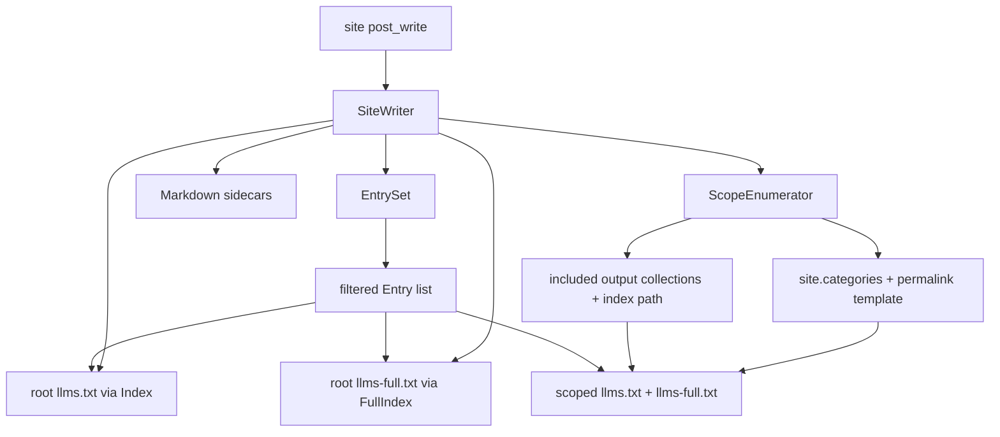

# Architecture Decision: Category and Collection llms Indexes

## Requirements & Constraints

### Functional requirements

- Emit scoped `llms.txt` (Markdown index) and `llms-full.txt` (concatenated corpus) beside aggregator HTML pages.
- Categories: e.g. `/categories/fable/llms.txt` and `/categories/fable/llms-full.txt` listing only posts in that category.
- Collections: e.g. `/garden/llms.txt` and `/garden/llms-full.txt` listing only docs in that collection.
- Enablement should be boolean (or near-boolean) config that hooks into native Jekyll data — not a hard dependency on `jekyll-archives`, `jekyll-auto-authors`, or site-specific layouts.
- Reuse existing include/exclude/`llms: false` filtering so scoped indexes never publish entries the root index would refuse.

### Out of scope

- Author indexes (`/authors/`, `/authors/:author/`) — same sidecar idea later, but authors are not native Jekyll; defer.
- Tag indexes and collection-scoped tag archives (`/tags/`, `/garden/tags/:name/`).
- Changing Markdown sidecar placement for individual documents (already works).

### Ranked quality attributes

1. **Simplicity** — smallest extension to today's `EntrySet` → `Index` → `SiteWriter` pipeline.
2. **Maintainability** — no soft coupling to archive plugins' internal page objects.
3. **Fitness** — URLs land next to the human HTML index the operator already serves.
4. **Reversibility** — defaults off or additive; root behavior unchanged when flags are false.

### Technical constraints

- Gem already runs on `:site, :post_write` and writes into `site.dest`.
- Native Jekyll exposes `site.categories` (name → posts) and `site.collections[label].docs`, but does **not** define category archive URLs. Collection "index" URLs are also conventional (`/garden/` is often a separate page, as on this site via `_pages/garden.md`).
- Official [llms.txt](https://llmstxt.org/) allows the file in a subpath; `llms-full.txt` is a community companion (index vs concatenated corpus), not a strict schema — gem should pick one clear concatenation format and stick to it.
- Mutation testing + 100% line coverage remain non-negotiable for the gem.

## Components



| Component | Responsibility |
|-----------|----------------|
| `Entry` / `EntrySet` | Unchanged membership rules (include, exclude, `llms: false`). |
| `Index` | Render scoped or root link lists; accept title/description overrides for scopes. |
| `FullIndex` (new) | Concatenate Markdown bodies for a set of entries into `llms-full.txt`. |
| `Scope` (new) | `{ path_prefix, title, description, entries }` — one write target. |
| `ScopeEnumerator` (new) | Build scopes from `site.categories` / collections + config. |
| `SiteWriter` | Orchestrate root + scopes; keep HTML linker on document sidecars only. |

## Options Evaluated

- **A — Native scopes over EntrySet**: Boolean flags; category membership from `site.categories`; collection scopes from included output collections; path templates for where files land; filter the already-built `Entry` list.
- **B — Archive-page discovery**: After render, find category/collection archive pages (layouts, `jekyll-archives` objects, autopages) and attach sidecars from each page's post list.
- **C — Soft-depend on jekyll-archives config**: Read `jekyll-archives.permalinks` / enabled types as the primary source of truth for what to emit and where.

## Analysis

| Criterion | A Native scopes | B Page discovery | C Archives soft-dep |
|-----------|-----------------|------------------|---------------------|
| Fitness | High — matches "boolean + Jekyll categories/collections" | High for this site; fragile elsewhere | High only when archives plugin is present |
| Simplicity | Highest — one enumerator + reuse Index | Medium — multiple page shapes | Medium — dual config sources |
| Maintainability | High — stable Jekyll APIs | Low — plugin internals / layouts | Medium — optional coupling |
| Scalability | Fine for typical category/collection counts | Same | Same |
| Risk | Path template may mismatch site permalink (mitigate with config + optional archives hint) | Silent miss if layout/plugin changes | Useless without archives; wrong for collection indexes |

Key insights:

- Category **data** is native; category **URLs** are not. A path template is unavoidable. Default should be `/categories/:name/` (common plural form; this site). Optionally *prefer* `site.config.dig("jekyll-archives", "permalinks", "category")` when present so sites that already configured archives need no duplicate path — that is a convenience, not the architecture.
- Collection indexes are not first-class in Jekyll. Emitting at `/#{collection_label}/` matches the usual permalink prefix (and this site's `/garden/`). The human HTML index may be a separate page; the gem writes beside it in `dest`, which is what the operator wants.
- `llms-full.txt` is a parallel artifact for every scope that gets `llms.txt`, including root when enabled — same Entry filter, different renderer.
- Authors stay out: they need a different membership source (`_data/authors` / autopages), not `site.categories`.

## Decision

**Selected**: Option A — Native scopes over EntrySet

**Rationale**: Maximizes simplicity and maintainability while meeting the functional ask with boolean config against Jekyll's own category/collection models. Options B and C trade that for plugin-shaped discovery that is unnecessary once membership and path templates are explicit.

**Tradeoff**: Sites whose category HTML lives somewhere other than the default template must set `category_permalink` (or rely on the optional jekyll-archives permalink read). The gem will not refuse to write `llms.txt` if the HTML index is missing — LLM consumers still get a stable subpath URL ([llms.txt allows subpaths](https://llmstxt.org/)).

## Implementation Notes

### Config shape

```yaml
llms:
  markdown: true
  llms_txt: true
  llms_full: false          # new; root + scopes when true
  categories: false         # new; per-category indexes when true
  collection_indexes: false # new; per included output collection
  category_permalink: "/categories/:name/"  # :name replaced with category key
```

- When `jekyll-archives` permalink for category is configured and `category_permalink` is unset, use that value (optional convenience).
- Collection index path default: `/#{label}/` for each label in `include` that resolves to a writeable collection (not `pages`/`posts`).
- Root `llms.txt` behavior unchanged when the new flags are false.

### Scope filtering

- Start from the same `Entry` list `EntrySet` already produced.
- Category scope: entries whose `item` is in `site.categories[name]` (identity / URL match).
- Collection scope: entries whose section equals the collection label (already how `EntrySet` tags collection docs).

### File layout examples

| Scope | llms.txt | llms-full.txt |
|-------|----------|---------------|
| Root | `/llms.txt` | `/llms-full.txt` |
| Category `fable` | `/categories/fable/llms.txt` | `/categories/fable/llms-full.txt` |
| Collection `garden` | `/garden/llms.txt` | `/garden/llms-full.txt` |

### Index / full content

- Scoped `llms.txt`: reuse `Index` with overridden title (category name or collection label) and a short description (e.g. site description, or `"Category: fable"` / collection label).
- `llms-full.txt`: H1 matching the scope title; for each entry with a Markdown sidecar body, emit an H2 (entry title) then the body; HTML-only entries either omitted from full or listed as a link-only stub — prefer omit-from-full / link-in-index-only to avoid HTML dumps. Separate entries with a blank line (or `---` if tests prefer a hard delimiter).
- Do not add HTML `<link rel="alternate">` on archive pages in v1 unless trivially free; operator asked for the `.txt` files.

### Suggested module split

- `Jekyll::Llms::Scope` + `ScopeEnumerator`
- `Jekyll::Llms::FullIndex`
- Thin changes to `Config` and `SiteWriter`
- Prefer generalizing `Index#initialize` to accept `title:` / `description:` rather than forking a second index class for scopes

### Site config for this blog (later consumer work)

```yaml
llms:
  include: [pages, posts, garden]
  categories: true
  collection_indexes: true
  llms_full: true
  # category_permalink inherited from jekyll-archives if implemented
```

### Follow-ups (not this decision)

- Authors: third membership source + `/authors/:author/` template.
- Tags: same pattern as categories with `site.tags`.
- Optional: root `llms.txt` section linking to scoped indexes.
