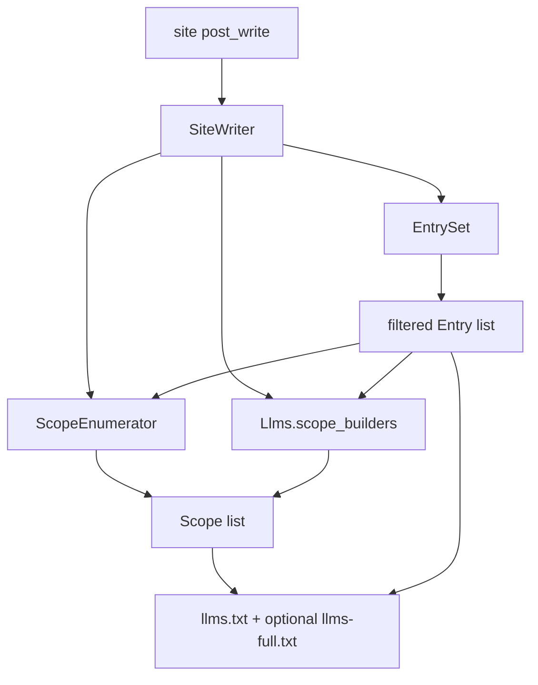

# Architecture Decision: Minimal Consumer Extension for Extra Scopes

## Requirements & Constraints

### Functional requirements

- Consumers (site `_plugins`, other gems) can contribute **additional write targets** so LLM artifacts land at URLs the gem does not know about (tags, authors, custom archives, etc.).
- Artifacts in scope for those targets: scoped `llms.txt`, scoped `llms-full.txt` when `llms_full` is on. Per-document `.md` sidecars remain tied to document URLs (not archive URLs).
- Membership for those targets must still honor **filter once**: prefer subsets of the root `EntrySet` list (include/exclude/`llms: false`), not a second include story.
- Must stay a small additive change on the current category/collection changeset — not a redesign.

### Out of scope for this decision

- Built-in tag or author indexes in the gem.
- A full plugin API with versioning, middleware, or config DSLs.
- Letting consumers replace or disable built-in category/collection enumeration (can be a later knob).
- New entry *sources* (documents outside pages/posts/included collections) — see Decision; follow-up if needed.

### Ranked quality attributes

1. **Simplicity** — fewest new concepts; one obvious registration call.
2. **Maintainability** — extension point does not entangle consumers with private `SiteWriter` methods.
3. **Fitness** — unblocks tags/authors and any “aggregation URL + subset of entries” pattern.
4. **Reversibility** — unused registry is a no-op; safe default for all existing sites.

### Technical constraints

- Gem already has `Scope` (`path_prefix`, `title`, `description`, `entries`) and `SiteWriter#write_scopes` as the write path.
- Jekyll `_plugins` load in the site process and can call into `Jekyll::Llms` after require.
- Mutation + 100% line coverage remain required; global registries need a clear reset for tests.

### Boundaries

- **In**: how consumers inject extra `Scope`s into the gem’s write pipeline.
- **Out**: inventing new membership models inside the gem; monkey-patch guidance as the “official” path.

## Components



| Component | Responsibility |
|-----------|----------------|
| `EntrySet` | Unchanged — sole membership gate for documents (and thus sidecars). |
| `Scope` | Unchanged value object — one URL prefix + entry subset + titles. |
| `ScopeEnumerator` | Unchanged — built-in category/collection scopes. |
| `Jekyll::Llms.scope_builders` | New — ordered list of callables `(site, config, entries) -> Array<Scope>`. |
| `SiteWriter#write_scopes` | Concatenate built-in scopes + builder results; write with existing Index/FullIndex path. |

## Options Evaluated

- **A — Document compose-alongside only**: No gem change; consumers reimplement scoped writes in a second `post_write` hook using public classes.
- **B — Scope-builder registry**: Minimal `register_scope_builder` + SiteWriter merge; gem owns Index/FullIndex/FileWriter for contributed scopes.
- **C — Scope builders + entry-source registry**: B plus `register_entry_source` feeding `EntrySet` for non-standard documents and automatic sidecars.
- **D — Fat write-context callback**: Single `on_write(ctx)` with helpers to add scopes, entries, and arbitrary files — maximum flexibility, largest surface.

## Analysis

| Criterion | A Compose-alongside | B Scope builders | C + Entry sources | D Fat callback |
|-----------|---------------------|------------------|-------------------|----------------|
| Fitness (tags/authors) | High but duplicate write logic | Highest for aggregations | Same as B for tags/authors | High |
| Fitness (“hidden” docs) | Consumer can DIY Entries | Via `include` only | Highest | Highest |
| Simplicity | Highest for gem; worst for consumer | Highest balanced | Medium | Lowest |
| Maintainability | Consumer drifts from gem write rules | Gem owns write path | Two registries | Opaque ctx API |
| Risk / reversibility | Zero gem risk | Tiny additive surface | Larger membership surface | Hard to shrink later |

Key insights:

- Tags/authors are **aggregations over documents already in `EntrySet`**, not new documents. Scope injection is the load-bearing need; sidecars already exist at document URLs once `garden`/`posts` are included.
- “New URLs” for archive indexes are `llms.txt` / `llms-full.txt` under path prefixes — that is exactly `Scope`. Archive pages themselves are not Markdown sources; asking for `.md` *at the archive URL* is a different product and YAGNI here.
- Option A already works but duplicates `write_index` / `write_full` / url_for / `llms_full?` — the pain that motivates a gem-side hook.
- Entry sources (C) solve a rarer case (docs outside Jekyll collections). Defer unless a concrete consumer needs it; `include` covers normal “hidden” collections.

## Decision

### Choice Pre-Mortem

- **Consumers needed new documents, not just aggregations, and scope-only feels incomplete**: Partially checked — for tags/authors and collection-like content, `include` + scopes suffice; true non-Jekyll sources remain a documented follow-up (Option C), not a blocker.
- **Global registry makes tests / multi-site weird**: Checked — reset builders in test helper / `register` returns disposable; single Site per `jekyll build` is the normal case.
- **Builders ignore EntrySet and reintroduce a second filter**: Checked as invariant in docs/API — builders receive `entries` and must subset it; gem does not re-validate beyond writing what they return (trust + convention, same as internal enumerator).

**Selected**: Option B — Scope-builder registry

**Rationale**: Smallest change that removes consumer duplication while matching the system pattern (filter once, write many). Tags/authors and any custom aggregation URL become a short `_plugins` registration. Simplicity and maintainability beat C/D for this changeset.

**Tradeoff**: Documents that are not reachable via `include` still need either config (`include: […]`) or a later entry-source hook. Consumers who want that today keep a parallel hook for membership only — uncommon.

## Implementation Notes

### API (gem)

```ruby
module Jekyll
  module Llms
    def self.scope_builders
      @scope_builders ||= []
    end

    def self.register_scope_builder(&block)
      scope_builders << block
      block
    end

    def self.reset_scope_builders!
      @scope_builders = []
    end
  end
end
```

`SiteWriter#write_scopes`:

```ruby
def write_scopes(markdown_entries)
  (built_in_scopes + extra_scopes).each do |scope|
    write_index(markdown_entries, scope: scope, path: "#{scope.path_prefix}llms.txt")
    write_full(scope: scope, path: "#{scope.path_prefix}llms-full.txt") if config.llms_full?
  end
end

def built_in_scopes
  ScopeEnumerator.new(site: site, config: config, entries: entries).scopes
end

def extra_scopes
  Llms.scope_builders.flat_map { |builder| Array(builder.call(site, config, entries)) }
end
```

Always run builders (not gated on `categories?` / `collection_indexes?`). Those flags only affect `ScopeEnumerator`.

### Consumer sketch (devblog `_plugins`)

```ruby
Jekyll::Llms.register_scope_builder do |site, config, entries|
  template = site.config.dig("jekyll-archives", "permalinks", "tag") || "/tags/:name/"
  site.tags.filter_map do |name, items|
    scoped = entries.select { |entry| items.include?(entry.item) }
    next if scoped.empty?

    Jekyll::Llms::Scope.new(
      path_prefix: template.sub(":name", Jekyll::Utils.slugify(name)),
      title: name,
      description: "Tag: #{name}",
      entries: scoped
    )
  end
end
```

Same pattern for garden tags (`/garden/tags/:name/`) and authors (intersect by author front matter / `_data/authors.yaml`).

### Tests

- Unit: register a builder → SiteWriter (or thin helper under test) writes expected path; `reset_scope_builders!` in teardown.
- Mutant: registry append/reset and merge into write path must be observed.
- Document invariant: builders subset `entries`; empty scopes skipped by consumer or optionally by gem (`next if scope.entries.empty?`) for safety — prefer gem-side skip for empty contributed scopes (KISS, matches built-in enumerator).

### Follow-ups (not this minimal change)

- `register_entry_source` if a consumer has non-collection documents that need sidecars + root index membership.
- Optional `Scope` flags for per-scope artifact selection (`index:`, `full:`) if global `llms_full` is too coarse.
- Extract `ScopeWriter` if `SiteWriter` grows further — only if registration lands and duplication appears.
