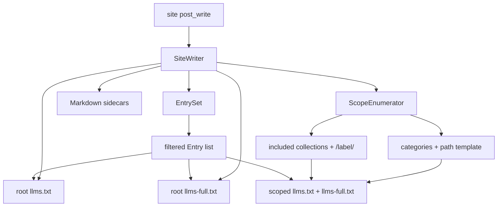

# Task: category-collection-llms-indexes

* Task ID: category-collection-llms-indexes
* Complexity: Level 3
* Type: feature

Optional root `llms-full.txt` plus per-category and per-collection scoped `llms.txt` / `llms-full.txt`, reusing `EntrySet`. Category paths soft-read from jekyll-archives when present, else `/category/:name/`.

## Creative Supersession

`memory-bank/active/creative/creative-category-collection-llms-indexes.md` was **guidance**, not the final contract. Intent clarification superseded these creative details:

| Creative said | Plan / build uses |
|---------------|-------------------|
| `category_permalink` config | **Removed** — YAGNI |
| Default `/categories/:name/` (plural) | **`/category/:name/`** — match jekyll-archives stock default |
| Optional archives read as convenience beside own config | Soft-read **only** source of customization (no gem path knob) |
| Suggested module split | Keep — `Scope`, `ScopeEnumerator`, `FullIndex`, thin `Config`/`SiteWriter`/`Index` |

Architecture Option A (native scopes over `EntrySet`) still stands. Path/config shape does not.

## Pinned Info

### Write pipeline

Shows how scoped writes reuse one filtered entry list.

## Component Analysis

### Affected Components

- `Config`: defaults + predicates for markdown/llms_txt/include/exclude → add `llms_full?`, `categories?`, `collection_indexes?`, and `category_permalink_template(site)` (or equivalent reader that digs archives then falls back).
- `Index`: root title/description from site config → accept optional `title:` / `description:` for scopes.
- `FullIndex` (new): render concatenated Markdown corpus for a set of entries.
- `Scope` (new): value object `{ path_prefix, title, description, entries }`.
- `ScopeEnumerator` (new): build category + collection scopes from site + config + root entries.
- `SiteWriter`: orchestrate root index/full + scopes; leave HTML linker on document sidecars only.
- `lib/jekyll/llms.rb`: require new constants.
- `README.md`: document the three new flags and category path behavior.

### Cross-Module Dependencies

- `SiteWriter` → `EntrySet` → entries (unchanged membership).
- `SiteWriter` → `ScopeEnumerator` → scopes (subset of entries + path/title).
- `SiteWriter` → `Index` / `FullIndex` → string content → `FileWriter`.
- `ScopeEnumerator` → `Config` for flags + category path template; → `site.categories` / `site.collections` for membership/labels.
- `FullIndex` → needs Markdown body per entry (reuse `MarkdownSource` or bodies already written — prefer reading via `MarkdownSource` at write time for entries that are markdown sources; omit HTML-only from full).

### Boundary Changes

- Public operator config grows three booleans (`llms_full`, `categories`, `collection_indexes`).
- Soft-read of `site.config["jekyll-archives"]["permalinks"]["category"]` when present (string with `:name`).
- No new gem dependency.

### Invariants & Constraints

- Must preserve root `llms.txt` / sidecar / HTML linker behavior when new flags are false. New flags default false; new behavior is opt-in.
- Must filter once via `EntrySet`; scopes only subset that list.
- Must not require jekyll-archives to be installed.
- Must keep 100% line + mutation coverage.
- Must not add `category_permalink` or author/tag/HTML-archive-linker scope.

## Open Questions

- [x] Category path config vs archives → Resolved: no gem path config; soft-read archives permalink; default `/category/:name/` (intent clarification; **supersedes creative**)
- [x] Architecture → Resolved: Option A native scopes (creative; still valid)
- [x] Full corpus format → Resolved: H1 scope title; per markdown entry H2 title + body; omit HTML-only from full; blank line between entries (creative guidance, tightened)
- [x] `:name` slugification → Resolved: `Jekyll::Utils.slugify(category_name)` so paths align with jekyll-archives default slug behavior

None unresolved — no creative phase re-entry required.

## Test Plan (TDD)

### Behaviors to Verify

- Config defaults: new flags false; predicates reflect merges.
- Config category template: absent archives → `/category/:name/`; present → configured string.
- Index: optional title/description overrides appear in output; root behavior unchanged without overrides.
- FullIndex: concatenates markdown entries; omits non-markdown; uses scope title as H1.
- ScopeEnumerator categories: one scope per `site.categories` key; entries intersect EntrySet; path uses template + slugified name.
- ScopeEnumerator collections: one scope per included writeable collection label (not pages/posts); path `/{label}/`.
- ScopeEnumerator flags off: empty scopes.
- SiteWriter: `llms_full` writes `/llms-full.txt`; `categories` writes category paths; `collection_indexes` writes collection paths; combination with archives config; flags false → no new files.
- Edge: excluded / `llms: false` post in a category → absent from scoped index.
- Edge: empty category after filter → still write empty-ish index or skip? → **skip writing scopes with zero entries** (KISS, avoid empty noise).

### Test Infrastructure

- Framework: Minitest + `mutant/minitest/coverage`
- Test location: `test/jekyll/llms/`
- Conventions: `*_test.rb`, `cover "Jekyll::Llms::..."`, `build_site` helper in `test_helper.rb`
- New test files: `test/jekyll/llms/full_index_test.rb`, `test/jekyll/llms/scope_enumerator_test.rb` (Scope can be covered via enumerator or a tiny `scope_test.rb` if needed)

### Integration Tests

- `site_writer_test.rb`: end-to-end fixture site with posts in categories + a garden collection; assert dest paths and content snippets.
- Config archives soft-read via unit test with struct site (no need to load jekyll-archives gem).

## Implementation Plan

Each numbered unit below is one TDD cycle: **failing tests first**, then production code, then refactor. Do not implement a unit’s production files before its tests exist and fail for the right reason.

1. **Config flags + category template** ✅
    - Tests first: `test/jekyll/llms/config_test.rb` — defaults false for new flags; merged true; `category_path_template` → `/category/:name/` without archives; uses archives permalink when set
    - Then code: `lib/jekyll/llms/config.rb` — DEFAULTS + predicates + template reader
    - Creative ref: superseded path decision (see Creative Supersession)

2. **Index title/description overrides** ✅
    - Tests first: `test/jekyll/llms/index_test.rb` — override title/description appear; omit empty description; no-override keeps site title/description
    - Then code: `lib/jekyll/llms/index.rb` — optional kwargs with site-config fallback

3. **FullIndex** ✅
    - Tests first: `test/jekyll/llms/full_index_test.rb` (new) — H1 title; H2 + body per markdown entry; skips entries without bodies; blank line between entries
    - Then code: `lib/jekyll/llms/full_index.rb` (new) — pure renderer over title + `[[entry, body], ...]` (or equivalent)
    - Wire require in `lib/jekyll/llms.rb` only when SiteWriter needs it (step 5 is fine)

4. **Scope + ScopeEnumerator** ✅
    - Tests first: `test/jekyll/llms/scope_enumerator_test.rb` (new) — category scopes from `site.categories` ∩ entries; slugified path; archives template; collection scopes for included writeable labels; flags off → `[]`; zero entries → omitted
    - Then code: `lib/jekyll/llms/scope.rb`, `lib/jekyll/llms/scope_enumerator.rb` (new)

5. **SiteWriter orchestration** ✅
    - Tests first: `test/jekyll/llms/site_writer_test.rb` — root `llms-full.txt`; category/collection dest paths + content; archives path; flags false → no new artifacts; excluded post absent from scoped index
    - Then code: `lib/jekyll/llms/site_writer.rb`, requires in `lib/jekyll/llms.rb`

6. **README** ✅
    - Files: `README.md`
    - Changes: document flags + category path / archives soft-read (docs-only; no test cycle)

7. **Verification** ✅
    - `bundle exec rake test` then `bundle exec mutant run` — both green (100% line + mutation)

## Technology Validation

No new technology - validation not required

## Challenges & Mitigations

- **Category key vs URL slug mismatch**: Mitigate with `Jekyll::Utils.slugify`; document that custom `slug_mode` in archives is out of scope for v1 (stock default only).
- **FullIndex needing rendered bodies**: Mitigate by reusing `MarkdownSource` in SiteWriter when writing full (same rescue/skip as sidecars); omit failed/HTML-only entries from full.
- **Mutation surface growth**: Keep Scope/FullIndex thin; prefer simplifying over exotic tests; follow `AGENTS.md` A/B rule.
- **Empty scopes**: Skip zero-entry scopes to avoid littering dest.

## Pre-Mortem

- **Shipped `category_permalink` or plural default “because creative said so”**: Plan already records supersession; preflight must reject drift back to creative path shape.
- **Scoped indexes re-implement include/exclude**: Invariant “filter once”; enumerator only intersects EntrySet with category/collection membership.
- **Soft-read treated as hard dependency**: Tests use plain config hashes; no gem add in gemspec.
- **PR bloat (authors, tags, HTML archive links)**: Explicit non-goals in brief; preflight checks scope.

## Preflight Findings

- PASS — TDD encoding strengthened (per-unit tests-first wording)
- PASS — Conventions align (`lib/jekyll/llms/*.rb`, `test/jekyll/llms/*_test.rb`, Config DEFAULTS bag, post-write SiteWriter)
- PASS — No overlapping FullIndex/Scope implementations in tree
- PASS — Requirements map to steps 1–6; creative path shape explicitly superseded
- ADVISORY: Custom jekyll-archives `slug_mode` ignored in v1 (document in README); revisit only if an operator hits it

## Status

- [x] Component analysis complete
- [x] Open questions resolved
- [x] Test planning complete (TDD)
- [x] Implementation plan complete
- [x] Technology validation complete
- [x] Pre-Mortem complete
- [x] Preflight
- [x] Build
- [ ] QA
