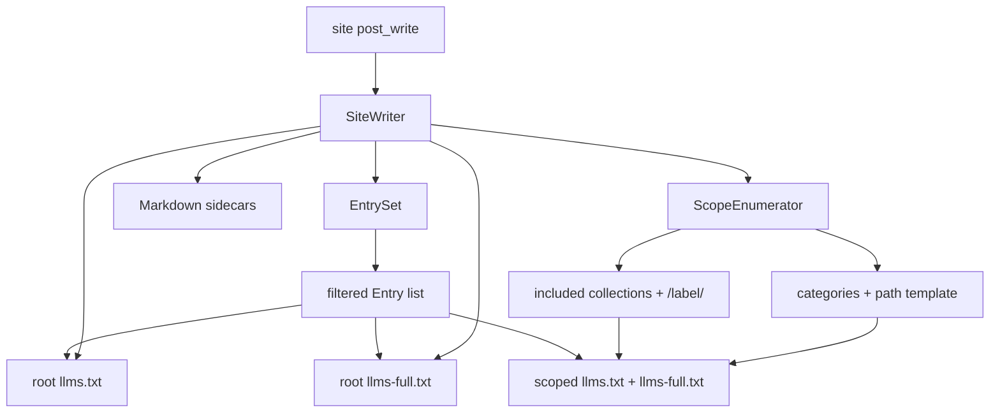

# TASK ARCHIVE: category-collection-llms-indexes

## SUMMARY

Shipped optional root `llms-full.txt` plus per-category and per-collection scoped `llms.txt` / `llms-full.txt`, reusing the existing `EntrySet` filter. Category paths soft-read `jekyll-archives.permalinks.category` when present, otherwise default to `/category/:name/` (jekyll-archives stock default). No gem-owned `category_permalink` config. Line and mutation coverage both at 100%.

## REQUIREMENTS

### User story

As a Jekyll site operator, I want optional per-category and per-collection `llms.txt` / `llms-full.txt` indexes (plus a root `llms-full.txt`) so that LLM consumers can fetch scoped corpora beside the human HTML indexes I already publish.

### Functional requirements

1. Boolean config flags: `llms_full`, `categories`, `collection_indexes` (all default `false`).
2. Category path: use `jekyll-archives.permalinks.category` when present; otherwise `/category/:name/`. No gem-owned path knob.
3. Collection path: `/{label}/` for included writeable collections (not `pages`/`posts`).
4. Reuse `EntrySet`; scoped indexes never publish entries the root index would refuse.
5. Reuse / lightly generalize `Index` for scoped titles/descriptions; add `FullIndex` for concatenation.
6. Keep the PR tight: no author/tag indexes, no HTML alternate links on archive pages, no root-index links to scopes.

### Constraints

- KISS / DRY / YAGNI — soft-read archives only; no duplicate path config.
- No hard dependency on `jekyll-archives`.
- Root `llms.txt` / Markdown sidecar / HTML linker behavior unchanged when new flags are false.
- 100% line coverage and 100% mutation coverage (`AGENTS.md`).

### Acceptance criteria (all met)

1. Flags default false; existing tests and root behavior stay green without new config.
2. `categories` writes `/category/{name}/llms.txt` (or archives-configured path) with only that category’s included entries.
3. `collection_indexes` writes `/{label}/llms.txt` for included writeable collections.
4. `llms_full` writes `llms-full.txt` at root and at each enabled scope.
5. Archives category permalink template is honored when set.
6. `bundle exec rake test` and `bundle exec mutant run` both pass.

## IMPLEMENTATION

### Architecture decision (creative → supersession)

Creative phase selected **Option A — Native scopes over EntrySet** over archive-page discovery (B) and soft-depending on jekyll-archives as primary truth (C). Rationale: simplest maintainable fit against native `site.categories` / collections; path templates unavoidable because category *URLs* are not native while category *membership* is.

Creative originally suggested gem-owned `category_permalink` and default `/categories/:name/` (plural). Intent clarification **superseded** that before build:

| Creative said | Shipped |
|---------------|---------|
| `category_permalink` config | Removed — YAGNI |
| Default `/categories/:name/` | `/category/:name/` — match jekyll-archives stock default |
| Archives read as convenience beside own config | Soft-read **only** source of customization |
| Module split (`Scope`, `ScopeEnumerator`, `FullIndex`) | Kept |

Option A architecture still stood; path/config shape did not.

### Write pipeline

### Key files

| File | Role |
|------|------|
| `lib/jekyll/llms/config.rb` | New flags + predicates; `category_path_template` (archives soft-read → default) |
| `lib/jekyll/llms/index.rb` | Optional `title:` / `description:` kwargs for scopes |
| `lib/jekyll/llms/full_index.rb` | Pure renderer: H1 scope title; H2 + body per markdown entry; omit nil/empty bodies |
| `lib/jekyll/llms/scope.rb` | Value object: path_prefix, title, description, entries |
| `lib/jekyll/llms/scope_enumerator.rb` | Category + collection scopes; flag gating; skip zero-entry scopes; slugify category names |
| `lib/jekyll/llms/site_writer.rb` | Root full + scoped writes; MarkdownSource for full bodies |
| `lib/jekyll/llms.rb` | Requires for new constants |
| `README.md` | Documents flags, archives soft-read, `slug_mode` out of scope for v1 |

### Notable implementation choices

- **Filter once:** `ScopeEnumerator` intersects `EntrySet` output with category/collection membership; does not re-implement include/exclude.
- **Slugification:** `Jekyll::Utils.slugify(category_name)` for `:name`; custom archives `slug_mode` out of scope for v1 (README note).
- **Empty scopes:** skipped (no empty noise in dest).
- **Full corpus:** HTML-only / failed markdown omitted from full; still may appear in index.
- **Flag ownership:** enumerator owns category/collection flag gating; SiteWriter does not wrap with redundant `scoped_indexes?` guards (mutants forced simplification).

### TDD build order (executed)

1. Config flags + category template
2. Index title/description overrides
3. FullIndex
4. Scope + ScopeEnumerator
5. SiteWriter orchestration
6. README
7. Verification (`rake test` + `mutant run`)

## TESTING

- Framework: Minitest + `mutant/minitest/coverage`
- New/extended suites: `config_test.rb`, `index_test.rb`, `full_index_test.rb`, `scope_enumerator_test.rb`, `site_writer_test.rb`
- Preflight: PASS (`.preflight-status`); advisory only on custom `slug_mode`
- Build verification: 67 tests, 100% line coverage, 100% mutation coverage
- QA: PASS (`.qa-validation-status`); one trivial README intro sync; no substantive rework
- Commands green at close: `bundle exec rake test`, `bundle exec mutant run`

## LESSONS LEARNED

### Technical

- When a later stage already filters (enumerator flags, FullIndex nil/empty bodies), an earlier identical guard often survives mutation — prefer one owner of each rule over layered checks.
- Mutant’s `cover` mapping means optional kwargs exercised only from another class’s tests may not select the callee as subject; kill those defaults from the class’s own unit tests.

### Process

- Recording creative supersession explicitly in `tasks.md` (not only chat) stopped “creative said so” drift during build and QA.
- Treating creative as guidance while pinning intent-clarified path/config in the plan prevented shipping YAGNI (`category_permalink`, plural default).

## PROCESS IMPROVEMENTS

- Keep a visible supersession table in the plan whenever creative output is partially overturned by later intent clarification — it is cheap insurance against path-shape / YAGNI drift.
- Preflight’s tests-first wording per implementation unit matched how the build actually ran; keep that encoding for L3 plans.

## TECHNICAL IMPROVEMENTS

- Double `MarkdownSource` read when both markdown sidecars and `llms_full` are on is acceptable KISS for v1; cache bodies only if it becomes a measured cost.
- Follow-ups deferred by design: author indexes, tag indexes, HTML alternate links on archive pages, root `llms.txt` links to scopes, consumer-facing scope registry (separate creative exists for a later run).

## NEXT STEPS

- Optional consumer extension for extra scopes (tags/authors/custom archives) — design captured outside this archive for a subsequent task; not part of this feature’s deliverable.
- Revisit custom jekyll-archives `slug_mode` only if an operator hits a mismatch.
